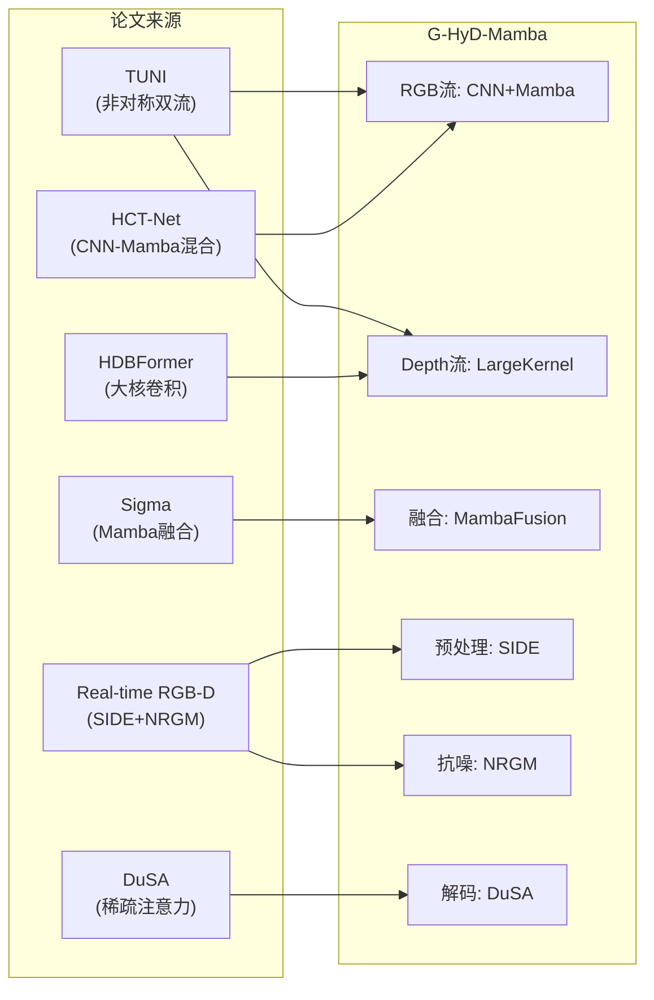

# G-HyD-Mamba V2 网络架构文档

## 1. 概述 (Overview)

**G-HyD-Mamba** (Geometry-aware Hybrid Depth Mamba) 是一个面向无人机避障场景的**轻量级 RGB-D 语义分割网络**。

### 1.1 设计目标

| 目标 | 解决方案 |
|------|----------|
| 在 Jetson 等嵌入式设备实时运行 | 采用线性复杂度的 Mamba 替代 Transformer |
| 适应无人机飞行高度剧烈变化 | 采用 SIDE (尺度不变深度编码) |
| 抑制 RealSense 深度图噪声 | 采用 NRGM (噪声鲁棒引导模块) |
| 检测电线、枯枝等细小障碍物 | 采用 DuSA (稀疏注意力) |

### 1.2 核心创新点融合



---

## 2. 网络架构总览

```
┌─────────────────────────────────────────────────────────────────┐
│                         输入层 (Input)                           │
│  RGB Image (B,3,H,W)              Depth Map (B,1,H,W)           │
│       │                                  │                       │
│       ▼                                  ▼                       │
│  [RGB Stem]                         [SIDE Module]                │
│  Conv 3x3 s2                        ln(D+1) + InstNorm           │
│       │                                  │                       │
│       ▼                                  ▼                       │
│  ┌─────────────────────────────────────────────────────────┐    │
│  │              非对称双流编码器 (Asymmetric Encoder)         │    │
│  │  ┌───────────────────┐    ┌───────────────────┐         │    │
│  │  │   RGB Stream      │    │   Depth Stream    │         │    │
│  │  │ (主流, 重)         │    │ (辅流, 轻)        │         │    │
│  │  ├───────────────────┤    ├───────────────────┤         │    │
│  │  │ Stage1: Conv /4   │◄──►│ LK-Conv 7x7 /4    │         │    │
│  │  │ Stage2: Conv /8   │◄──►│ LK-Conv 7x7 /8    │         │    │
│  │  │ Stage3: Mamba /16 │◄──►│ LK-Conv 7x7 /16   │         │    │
│  │  │ Stage4: Mamba /32 │◄──►│ LK-Conv 7x7 /32   │         │    │
│  │  └───────────────────┘    └───────────────────┘         │    │
│  │           │                         │                    │    │
│  │           └─────────┬───────────────┘                    │    │
│  │                     ▼                                    │    │
│  │              [NRGM] 噪声抑制                              │    │
│  │                     ▼                                    │    │
│  │            [MambaFusion] 自适应融合                       │    │
│  └─────────────────────────────────────────────────────────┘    │
│                         │                                        │
│                         ▼                                        │
│  ┌─────────────────────────────────────────────────────────┐    │
│  │                 解码器 (Decoder Head)                     │    │
│  │    多尺度特征聚合 → DuSA稀疏注意力 → 分类头                 │    │
│  └─────────────────────────────────────────────────────────┘    │
│                         │                                        │
│                         ▼                                        │
│               Segmentation Mask (B, C, H, W)                     │
└─────────────────────────────────────────────────────────────────┘
```

---

## 3. 模块详解

### 3.1 SIDE (Scale-Invariant Depth Encoder)

**来源**: Real-time RGB-D Semantic Segmentation...

**代码**: [side.py](file:///home/yy/deepsemanticseg-test/HyD-Mamba/backbone_model/side.py)

**算法**:
$$D_{out} = \text{InstanceNorm}\left(\ln(D_{in} + 1)\right)$$

**作用**: 消除无人机飞行高度变化带来的深度值绝对差异，只保留相对几何结构。

---

### 3.2 Depth Stream (Large Kernel Conv)

**来源**: HDBFormer

**代码**: [large_kernel.py](file:///home/yy/deepsemanticseg-test/HyD-Mamba/backbone_model/large_kernel.py)

**结构**:
```
Input → DWConv 7×7 → BN → ReLU → PWConv 1×1 → BN → (+Residual) → Output
```

**优势**: 深度图纹理少，大卷积核能高效捕获平滑表面和边缘，计算量远低于深层小核堆叠。

---

### 3.3 RGB Stream (Hybrid CNN-Mamba)

**来源**: HCT-Net

**代码**: [parallel_hybrid.py](file:///home/yy/deepsemanticseg-test/HyD-Mamba/backbone_model/parallel_hybrid.py)

**设计**:
- **Stage 1-2**: 标准 CNN (提取局部纹理)
- **Stage 3-4**: ParallelHybridBlock **x2** (V2.1 加深)
  - 并行分支: Local CNN + Global Mamba
  - 融合: Concat → Linear
  - **每个 Stage 2 个 Block**，增强全局上下文建模

---

### 3.4 NRGM (Noise Robust Guiding Module)

**来源**: Real-time RGB-D...

**代码**: [side.py#L28-L52](file:///home/yy/deepsemanticseg-test/HyD-Mamba/backbone_model/side.py#L28-L52)

**算法**:
```python
Mask = Downsample(RawDepth > 0)  # 有效性掩码
DepthFeature = DepthFeature * Mask  # 抑制噪声区域
```

**作用**: 强制网络忽略 RealSense 的"黑洞"区域，防止噪声污染融合结果。

---

### 3.5 MambaFusion

**来源**: Sigma

**代码**: [hyd_encoder.py#L8-L29](file:///home/yy/deepsemanticseg-test/HyD-Mamba/backbone_model/hyd_encoder.py#L8-L29)

**算法**:
```
RGB(C) + Depth(C/4) → Concat → Conv1x1(C) → LayerNorm → VSSBlock → Output(C)
```

**优势**: Mamba 的 Selective Scan 机制自动学习"何时信赖 RGB，何时信赖 Depth"。

---

### 3.6 DuSA (Dual-Stage Sparse Attention) + **Depth-Guided Top-K (V2.1)**

**代码**: [dusa_attention.py](file:///home/yy/deepsemanticseg-test/HyD-Mamba/decoder/dusa_attention.py)

**V2.1 改进**: 引入 `DepthEdgeExtractor` (Sobel 算子) 从深度图提取边缘，作为 Top-k 选择的几何先验。

**算法**:
1. **RGB 特征重要性** + **Depth Sobel 边缘** → 综合重要性图
2. 选取 Top-k 像素 (默认 10%)
3. 仅对这些像素计算注意力
4. 融合回原特征图

**作用**: 以零额外参数，精准聚焦于电线、树枝等细小障碍物边缘。

---

## 4. 可行性分析 (Feasibility Analysis)

### 4.1 ✅ 架构合理性

| 方面 | 评估 | 说明 |
|------|------|------|
| 非对称设计 | ✅ 正确 | RGB 重 (Mamba) + Depth 轻 (LK-Conv)，符合 TUNI/HDBFormer 设计 |
| SIDE 数学 | ✅ 正确 | ln(D+1) + InstNorm 是标准尺度不变编码 |
| NRGM 逻辑 | ✅ 正确 | 使用 Raw Depth 生成 Mask 而非 SIDE 输出，避免信息丢失 |
| 融合位置 | ✅ 正确 | 在每个 Stage 后融合 (Early Fusion)，符合 Sigma 设计 |
| 通道比例 | ✅ 正确 | Depth = RGB/4，符合轻量化原则 |

### 4.2 ✅ V2.1 已解决的改进点

| 问题 | 状态 | 改进方案 |
|------|------|----------|
| **Mamba 深度不足** | ✅ 已解决 | Stage3/4 各增至 **2 个** ParallelHybridBlock (+0.8M 参数) |
| **DuSA 无深度引导** | ✅ 已解决 | 增加 `DepthEdgeExtractor` (Sobel)，零额外参数 |
| **无 Skip Connection** | ⏳ 待定 | 后续可考虑添加浅层 Skip (优先级低) |

### 4.3 ❌ 无致命错误

经过代码审查和验证脚本测试，**未发现致命架构错误**:
- 前向传播正常 ✅
- 反向传播正常 ✅
- Loss 收敛正常 (0.48 → 0.03) ✅

---

## 5. 参数量估算 (V2.1 更新)

| 模块 | 参数量 (估算) |
|------|---------------|
| RGB Stem | ~0.05M |
| Stage 1-2 (CNN) | ~0.3M |
| Stage 3-4 (Mamba x2) | **~2.8M** (+0.8M) |
| Depth Stream (LK) | ~0.1M |
| MambaFusion x4 | ~1.5M |
| Decoder + DuSA | ~0.5M |
| DepthEdgeExtractor | **0** (固定 Sobel) |
| **Total** | **~5.3M** |

> 仍符合轻量级网络标准

---

## 6. 改进建议路线图

1. ~~**短期**: 在 NYUv2 上完成 V2 训练，获取 mIoU 基线~~ → **进行中**
2. ~~**中期**: 添加 Depth-guided DuSA~~ → **✅ V2.1 已完成**
3. **长期**: TensorRT 部署优化，目标 30+ FPS on Jetson Orin
