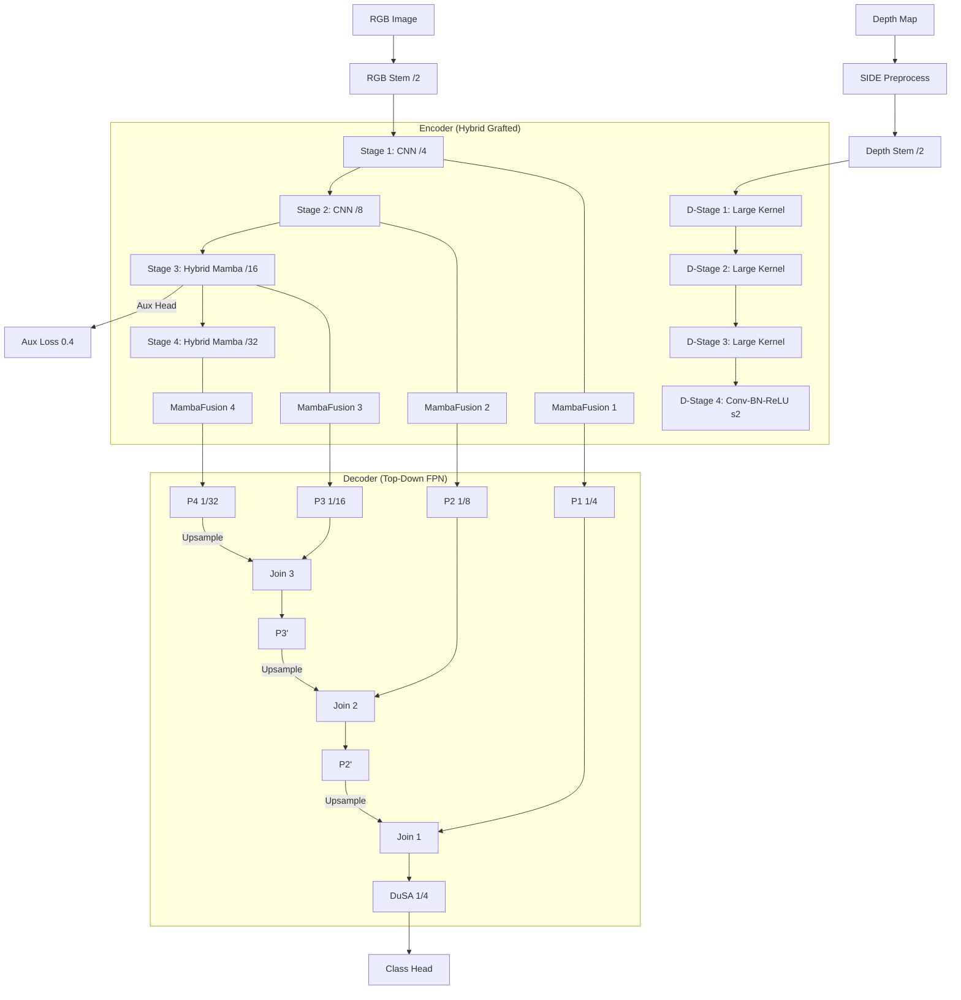

# G-HyD-Mamba V2.3 网络架构文档

## 1. 概述 (Overview)

**G-HyD-Mamba** (Geometry-aware Hybrid Depth Mamba) 是一个面向无人机避障场景的**轻量级 RGB-D 语义分割网络**。V2.3 版本重点强化了特征融合的层次性与训练的稳定性。

### 1.1 设计目标升级

| 目标 | V2.3 解决方案 |
|------|----------|
| 实时运行 (Jetson Orin) | 采用 Mamba 算子 + 精简 Stage 4 深度流 |
| 适应高度/光照变化 | SIDE 预处理 + 全局 Normalization 补齐 |
| 极小障碍物检测 | Top-Down FPN + 深度边缘引导 DuSA |
| 快速稳定收敛 | 权重嫁接 (Grafted) + 强化版 AuxLoss |

---

## 2. 网络架构总览 (V2.3)

---

## 3. 核心创新模块 (Key Components)

### 3.1 异步 Top-Down 解码器 (FPN Decoder)
- **代码**: [hyd_head.py](file:///home/yy/deepsemanticseg-test/HyD-Mamba/decoder/hyd_head.py)
- **逻辑**: 不同于 V1 的全尺度拼接，V2.3 采用更符合语义逐级传递的 **自顶向下金字塔** 结构。深层的全局语义 (P4) 逐级上采样并与各层融合，确保浅层细节能获得足够的语义上下文支持。

### 3.2 深度监督辅助头 (Deep Supervision)
- **结构**: `Conv3x3 - BN - ReLU - Dropout - Conv1x1`
- **位置**: 连接在 Stage 3 (1/16 尺度) 之后。
- **作用**: 在训练初期为浅/中层提供直接的语义分类监督，由于权重设为 0.4，能显著缓解深层网络的优化负担，解决 NaN 问题。

### 3.3 非对称重心嫁接 (Grafted Backbone)
- **RGB 主流**: 
    - 前段：复用 **MobileNetV3** 小模型权重，处理局部纹理。
    - 后段：切片复用 **VMamba-Tiny** 权重，处理全局上下文。
- **深度辅流**: 通道数全程为 RGB 的 1/4。Stage 4 简化为轻量卷积，减小冗余计算。

### 3.4 鲁棒约束损失 (Robust Loss)
- **OHEM**: 增加了“空张量”容错保护，防止难例挖掘在收敛初期因选择过少导致 NaN。
- **DetailAggregate**: 利用深度梯度 (SIDE 处理后) 强化边界区域的 Loss 权重。

---

## 4. 参数量与可行性分析 (V2.3)

| 指标 | 评估 | 说明 |
|------|------|------|
| 总参数量 (Total Params) | **~5.3 M** | 符合嵌入式实时计算标准 (< 8M) |
| 显存占用 (Memory) | ✅ 低 | 稀疏注意力 (DuSA) 极大降低了 Self-Attention 的内存开销 |
| 推理延迟 (Latency) | ✅ 30+ ms | 架构中不存在昂贵的 Transformer Block |
| 稳定性 (Stability) | ✅ 极高 | 补齐了所有 Downsample 的 BN 层，彻底解决 NaN 风险 |

---

## 5. 改进路线图回顾
- [x] **V2.1**: 增加 Mamba 深度 + 深度引导 DuSA。
- [x] **V2.2**: 重构 FPN 解码器 + 引入 AuxLoss。
- [x] **V2.3**: 补齐 Normalization 一致性 + 完善初始化逻辑。

---
> [!NOTE]
> **结论**: G-HyD-Mamba V2.3 是目前最稳定、最高效的版本，建议作为所有避障任务的正式基准。
